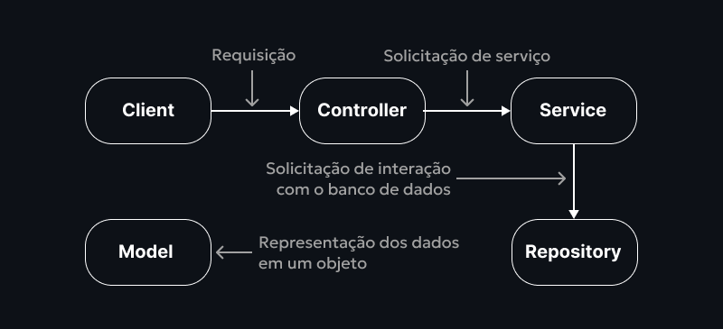

Este é um projeto criado com o intuito de aprimorar meus conhecimentos sobre
desenvolvimento de API's RESTful seguras e eficazes, focando a atenção 
em questões como validação de dados, autenticação e autorização de usuários com
Spring Security e JWT. Além disso, foram usados outras dependências e ferramentas 
para a otimização do desenvolvimento, como o Flyway para o versionamento e melhor
controle do banco de dados e o Apache Maven para o gerenciamento de dependências. 
Por fim, estou muito feliz com o resultado final, e espero que este repositório 
possa te ajudar a extrair um pouco de conhecimento também. E desde já, obrigado.

## O que foi utilizado para desenvolver o projeto:

- Java como linguagem de programação;
- Spring Boot e Spring Security como frameworks;
- Arquitetura MVC;
- Principais Dependências: 
*1. DevTools;* 
*2. JPA;* 
*3. JDBC;* 
*4. Flyway;* 
*5. Postgresql;* 
*6. Validation;* 
*7. Jjwt-Api;* 
*8. Jjwt-Impl;* 
*9. Jjwt-Jackson.* 
- IntelliJ como IDE;
- Postman para testes de requisição.

## Sumário do que será dito no README:

1. **Arquitetura em Camadas;** 
   1.1. Controllers; 
   1.2. Services; 
   1.3. Model; 
   1.4. Repositories. 
2. **Validação de dados;** 
   2.1. Validate; 
   2.2 DTO's; 
3. **Versionamento de banco de dados;** 
   3.1 Flyway; 
   3.2 Migrations; 
4. **Configuração de segurança;** 
   4.1 Spring Security; 
   4.2 Vulnerabilidades de API's; 
   4.3 SecurityFilterChain do Spring Security; 
5. **Autenticação de usuários;** 
   5.1 UserDetails e UserDetailsService; 
   5.2 Classe UsernamePasswordAuthenticationToken; 
   5.3 Provedores de autenticação do Spring Security; 
   5.4 Gerenciador de autenticação do Spring Security; 
6. **Geração e validação de tokens (JWT);** 
   6.1 JwtService gerenciar os tokens (JWT); 
   6.2 Geração de tokens (JWT); 
   6.3 Validação de tokens (JWT) com JwtFilter. 

## 1. Arquitetura em Camadas:

Arquiteturas são como estruturas que os sistemas utilizamn para poderem
organizar os fluxos de comunicação e as interações entre as diferentes partes
ou componentes do sistema. A arquitetura selecionada para este projeto é
a *"Arquitetura em Camadas"*, que define fortemente a responsabilidade de cada
camada presente na lógica organizacional do sistema, sendo elas:

- **Model:** Reponsável pela representação dos dados;
- **Controller:** Responsável pela comunicação entre cliente e servidor;
- **Service:** Responsável pela lógica de negócio do sistema;
- **Repository:** Responsável pela comunicação entre aplicação e banco de dados.

